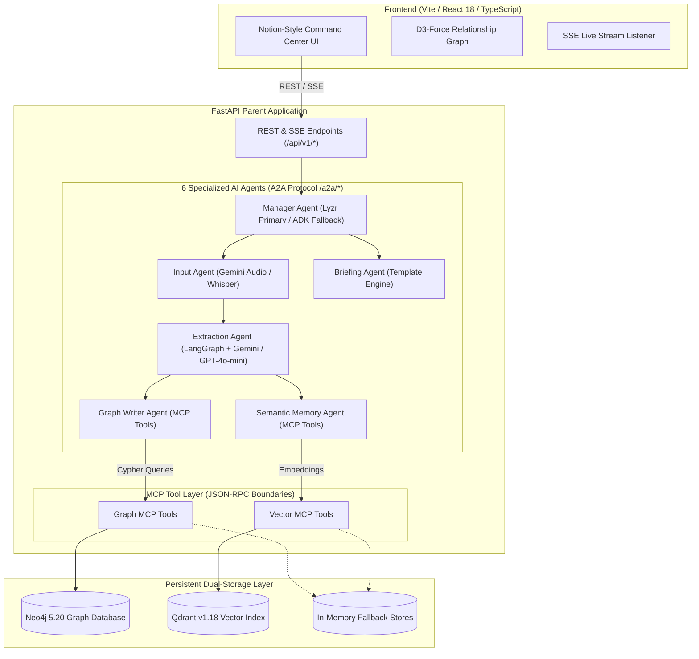

<div align="center">

# 💎 Tesseract (ThreadLine)
### *Enterprise Multi-Agent Meeting Intelligence & Executive Chief of Staff*

[](https://python.org)
[](https://fastapi.tiangolo.com)
[](https://react.dev)
[](https://typescriptlang.org)
[](https://neo4j.com)
[](https://qdrant.tech)
[](https://lyzr.ai)
[](https://google.ai)

<p align="center">
  <b>Tesseract is an enterprise-grade AI Chief of Staff platform that does not just transcribe meetings into dead text — it UNDERSTANDS decision lifecycles, TRACKS cross-meeting supersession chains, and REMEMBERS organizational context.</b>
</p>

[Explore Overview](#-key-features) • [System Architecture](#-system-architecture) • [Getting Started](#-getting-started) • [API Reference](#-api-reference)

---

</div>

## 📌 Executive Summary

Existing AI tools like Otter.ai, Fireflies, or Zoom AI transcribe meetings into isolated walls of text. They treat every meeting as an island, failing to answer critical questions:
* *What was actually decided?*
* *Did today's decision contradict a decision made 3 weeks ago?*
* *Is that architectural choice still valid, or was it superseded?*

**Tesseract solves this by building a persistent, multi-agent organizational memory.** It combines **Neo4j Knowledge Graphs** (for tracking decision evolution) with **Qdrant Vector Storage** (for natural language semantic memory), coordinated by a **Lyzr Studio & Google ADK multi-agent fleet**.

---

## ✨ Key Features

### 🔄 1. Cross-Meeting Decision Lifecycle Tracking
Decisions are modeled as stateful entities with a formal lifecycle:
`proposed → confirmed → under_review → superseded`
* Automatically creates `SUPERSEDES` links when a new meeting replaces a previous decision.
* Maintains a full lineage audit trail so no historical rationale is lost.

### ⚔️ 2. Contradiction & Conflict Resolution Engine
* Automatically cross-references newly extracted claims against prior decisions.
* Detects logical conflicts (e.g., Auth0 vs. EU Data Residency regulations) with confidence scores and reasoning traces.
* Provides a human-in-the-loop **"Keep / Switch / Flag"** resolution dashboard.

### 🧠 3. Dual Graph & Vector Memory
* **Neo4j Knowledge Graph:** Maps entities, decisions, action items, and topic relationships as connected graph nodes.
* **Qdrant Vector Index:** Embeds extracted facts into 384-dimensional space via `all-MiniLM-L6-v2` or `Gemini Embeddings` for fast similarity search.

### 🛡️ 4. GDPR Article 17 Cascading Purge
* Implements a compliance engine (`DELETE /api/v1/governance/purge/{name}`) to scrub speaker identity metadata across Qdrant vector points and Neo4j graph nodes without corrupting decision records.

### ⚡ 5. Zero-Dependency Graceful Degradation
* Automatically falls back to `InMemoryGraphStore` and `InMemoryVectorStore` (with deterministic hash embeddings) if Neo4j or Qdrant cloud services are unreachable, ensuring 100% demo availability.

---

## 🏗 System Architecture



---

## 🤖 AI Agent Workflow

| Agent | Core Responsibility | Primary Engine | Fallback Engine |
|---|---|---|---|
| 👑 **Manager Agent** | Orchestrates full meeting processing pipeline | Lyzr Studio API | Google ADK `RemoteA2aAgent` |
| 📥 **Input Agent** | Ingests text files & transcribes audio files | Gemini Flash Multimodal Audio | OpenAI Whisper API (`whisper-1`) |
| 🧠 **Extraction Agent** | Structured JSON fact & conflict extraction | LangGraph + Gemini Flash Lite | OpenAI `gpt-4o-mini` |
| ✍️ **Graph Writer Agent** | Persists decisions, entities & supersessions to Neo4j | Graph MCP Tools | InMemoryGraphStore |
| 🔍 **Semantic Memory Agent**| Vector-indexes facts & claims for search | Qdrant Vector MCP | InMemoryVectorStore (Hash) |
| 📄 **Briefing Agent** | Generates executive summaries & conflict alerts | Jinja2 / Markdown Template | Static Executive Summarizer |

---

## 🛠 Technology Stack

* **Frontend:** React 18, TypeScript, Vite, React Router v6, D3-Force Graph (`react-force-graph-2d`), Lucide Icons, `react-dropzone`.
* **Backend:** FastAPI, Uvicorn, Pydantic v2 (`pydantic-settings`), Python 3.11, `python-multipart`, SSE Streaming.
* **AI & Agent Frameworks:** Lyzr Studio API, Google ADK (`google-adk[a2a]`), LangGraph, OpenAI SDK, Google Generative AI SDK.
* **Databases:** Neo4j 5.20 (Knowledge Graph), Qdrant v1.18 (Vector DB), In-Memory Stubs.
* **Embeddings:** `all-MiniLM-L6-v2` (384-dim), `models/gemini-embedding-001` (384-dim Matryoshka), Hash-based fallback.
* **Deployment:** Vercel (Frontend), Render (FastAPI Backend), Docker Compose (Local Dev DBs).

---

## 🚀 Getting Started

### Prerequisites
* **Python:** 3.11+
* **Node.js:** 18+
* **Docker:** (Optional, for local Neo4j & Qdrant)

### 1. Repository Setup

```bash
git clone https://github.com/sudeeepaa/Tesseract.git
cd ThreadLine
```

### 2. Backend Setup

```bash
# Create and activate virtual environment
python -m venv .venv
# Windows:
.venv\Scripts\activate
# Linux/macOS:
source .venv/bin/activate

# Install dependencies
pip install -r requirements.txt
```

Create a `.env` file in the root directory:

```env
# LLM Backend
EXTRACTOR_BACKEND=gemini
GEMINI_API_KEY=your_gemini_api_key
GEMINI_MODEL=gemini-flash-lite-latest

# Lyzr Studio (Primary Orchestrator)
LYZR_API_KEY=your_lyzr_api_key
LYZR_AGENT_ID=your_lyzr_agent_id

# Neo4j Graph Database
GRAPH_BACKEND=neo4j
NEO4J_URI=neo4j+ssc://your-instance.databases.neo4j.io
NEO4J_USER=f3074b19
NEO4J_PASSWORD=your_neo4j_password

# Qdrant Vector Database
VECTOR_BACKEND=qdrant
QDRANT_URL=https://your-instance.cloud.qdrant.io
QDRANT_API_KEY=your_qdrant_api_key

# Embeddings
EMBEDDING_BACKEND=sentence_transformers
EMBEDDING_MODEL=all-MiniLM-L6-v2
EMBEDDING_DIM=384
```

Start the local backend server:

```bash
uvicorn backend.main:app --reload --host 0.0.0.0 --port 8000
```

### 3. Frontend Setup

```bash
cd frontend
npm install

# Start Vite dev server
npm run dev
```

Open `http://localhost:5173` in your browser.

---

## 🔌 API Reference Table

| Method | Endpoint | Description |
|---|---|---|
| `GET` | `/api/v1/health` | Service health status |
| `GET` | `/api/v1/status` | Connectivity details for Neo4j, Qdrant, and LLM backends |
| `POST` | `/api/v1/pipeline/run` | Triggers meeting processing pipeline (SSE Stream) |
| `GET` | `/api/v1/meetings` | Returns list of ingested meetings and summaries |
| `GET` | `/api/v1/briefing` | Returns executive briefing and decision lifecycle feeds |
| `GET` | `/api/v1/graph` | Returns nodes and edges for D3 relationship graph |
| `GET` | `/api/v1/conflicts` | Returns active logical contradictions needing resolution |
| `POST` | `/api/v1/conflicts/resolve` | Human-in-the-loop conflict resolution (`keep`/`switch`/`flag`) |
| `POST` | `/api/v1/search` | Semantic natural language search over Qdrant memory |
| `POST` | `/api/v1/demo/seed` | Seeds sample meetings from `data/Demo` |
| `DELETE` | `/api/v1/governance/purge/{name}` | GDPR Article 17 cascading speaker PII purge |

---

## ⚖️ License & Acknowledgments

Built for hackathon demonstration with production-grade architecture patterns.
Special thanks to the **Lyzr Studio**, **Google ADK**, **Neo4j**, and **Qdrant** teams!
